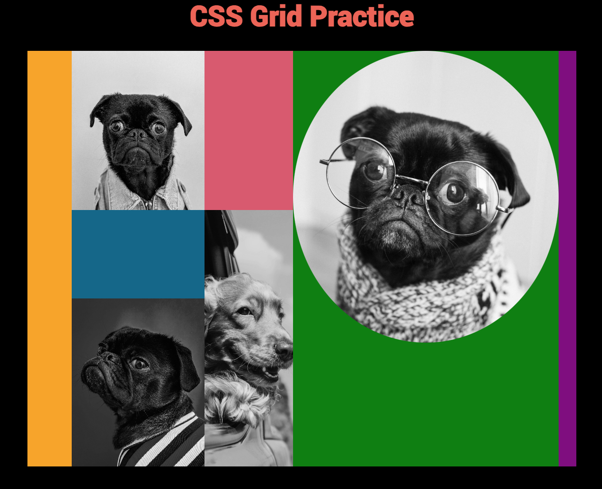

# Css-Grid-Practice

 I came across a really cool photo posted by Bloombergbusiness on instagram and instantly had a feeling that I need to copy it. You can see the image below to your left and you can see my copy of it to the right. I used some cool dog pictures and created the gallery using HTML and CSS. I used a little bit of JS for something I could have done with CSS, but I wanted to challenge myself, as I am slowly picking up JS. Check it LIVE --> <a href="https://hamzaibrahimi.github.io/Css-Grid-Practice/">Cool Gallery</a>

    

    
 Screen Shot from Instagram 

    
    

    

    
 My Copy 

    
    

    

